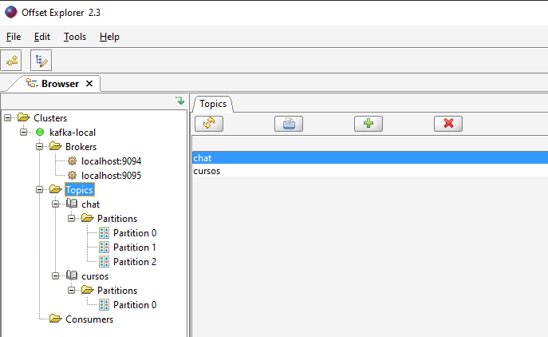

# Hands-On

Note: Run the commands in PowerShell

## Create a topic

``` powershell
./kafka/bin/windows/kafka-topics.bat --create --topic cursos --bootstrap-server localhost:9094
```

## List topics

``` powershell
.\bin\windows\kafka-topics.bat --list --bootstrap-server localhost:9094,localhost:9095
```

## Delete topics

``` powershell
.\bin\windows\kafka-topics.bat --delete --topic cursos --bootstrap-server localhost:9094
```

## Create topic with partition and replication factor

Partitions improves performance with increased read and write capability.

Replication factor brings resiliency and availability to the topic.

``` powershell
.\bin\windows\kafka-topics.bat --create --topic chat --bootstrap-server localhost:9094 --partitions 2 --replication-factor 2
```

## Change Number of Partitions

Increasing the amount of partition increases the topic's read and write capability.

``` powershell
.\bin\windows\kafka-topics.bat --alter --topic chat --bootstrap-server localhost:9094 --partitions 3
```

## Visualize topics, partitions and replications

With Offset Explorer:



With command:

``` powershell
.\bin\windows\kafka-topics.bat --describe --topic chat --bootstrap-server localhost:9094
```


## Publishing messages

``` powershell
.\bin\windows\kafka-console-producer.bat --topic chat --bootstrap-server localhost:9094 
> Message one
> Message two
> Message Three
```

## Consuming messages

### Real-time

``` powershell
.\bin\windows\kafka-console-consumer.bat --topic chat --bootstrap-server localhost:9094
```

### Dammed messages

``` powershell
.\bin\windows\kafka-console-consumer.bat --topic chat --bootstrap-server localhost:9094 --from-beginning
```


### Dammed messages with properties

``` powershell
.\bin\windows\kafka-console-consumer.bat --topic chat --bootstrap-server localhost:9094 --from-beginning --property print.partition=true --property print.offset=true
```


### Dammed messages with properties by consumer group

To defining groups, set command `--group group-name`, example:

``` powershell
.\bin\windows\kafka-console-consumer.bat --topic chat --bootstrap-server localhost:9094 --from-beginning --property print.partition=true --property print.offset=true --group group1
```

In the image below, I simulated a producer with three instances of consumers in two groups. Messages are consumed balancing across groups.


